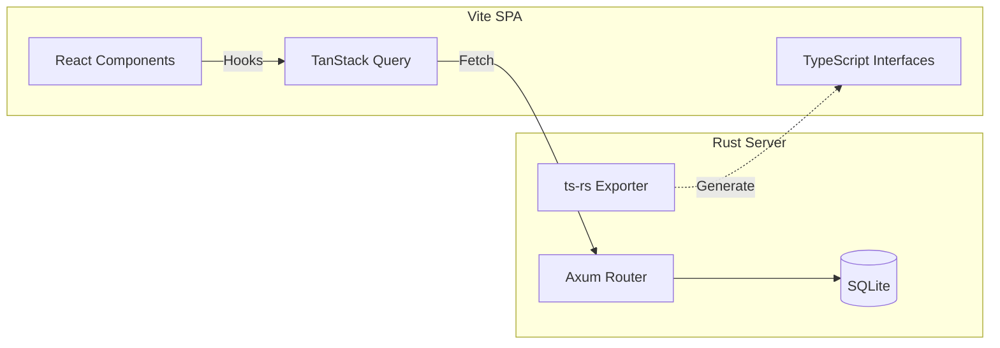

# Wallet OS 架构演进：高性能现代化方案 (Architecture V2)

## 1. 现状分析 (Current State)

目前的架构 (`Vanilla JS` + `Rust/Axum`) 在**运行时性能**上已经非常出色，因为没有框架开销。但在**开发效率**和**复杂交互维护**上存在局限性。

| 维度 | 当前架构 (V1) | 痛点 |
| :--- | :--- | :--- |
| **开发效率** | 低 | 手写 DOM 操作繁琐，状态管理混乱 |
| **UI/UX** | 基础 | 缺乏复杂的交互动效，组件复用难 |
| **可维护性** | 中 | 前后端代码分离，但前端缺乏类型安全 (Type Safety) |
| **生态集成** | 弱 | 难以直接使用现成的 UI 组件库 (如 shadcn/ui, AntD) |

## 2. "更强更快"的定义

当我们在 2024+ 年谈论"更快"的架构时，通常指：

1.  **开发更快 (Dev Velocity)**: 有现成的脚手架 (Scaffolds)，一键生成 CRUD，组件库开箱即用。
2.  **运行更快 (Runtime Perf)**: 使用编译型前端框架 (Svelte/Solid) 或 细粒度响应式技术，减少 Hydration 开销。
3.  **体验更流畅 (UX)**: 乐观更新 (Optimistic UI)、边缘渲染 (Edge SSR)、资源预加载。

## 3. 推荐架构方案 (Recommended Stacks)

这里提供两种升级路径，取决于您更看重**极致性能**还是**开发速度**。

### 方案 A：极致性能栈 (The "Bleeding Edge" Stack)
*适合追求绝对的加载速度和运行效率，且喜爱 Rust 生态的开发者。*

- **前端**: **SolidJS** 或 **Svelte 5** + **Vite**
  - *理由*: 均无虚拟 DOM (Virtual DOM)，直接编译为原生 DOM 操作，性能超越 React。
  - *构建*: Vite 提供毫秒级热更新 (HMR)。
- **后端**: **Rust (Axum)** (保持不变)
  - *优化*: 使用 `Typed-WASM` 或 `rspc` (Rust 的 tRPC 替代品) 实现前后端类型共享。
- **数据库**: **SQLite** + **Litestream** (用于实时备份)
- **部署**: 单一二进制文件 (嵌入前端静态资源)。

### 方案 B：全栈开发极速栈 (The "Rapid Dev" Stack)
*适合快速迭代产品，拥有庞大的社区资源和现成组件库。*

- **全栈框架**: **Next.js (App Router)** 或 **Remix**
- **语言**: TypeScript (全栈统一)
- **后端运行时**: **Bun** (比 Node.js 快 3-5 倍) 或 **Cloudflare Workers** (边缘计算)
- **UI 组件**: **shadcn/ui** + **Tailwind CSS**
  - *理由*: 复制粘贴即可用的高质量组件，极美的设计风格。
- **ORM**: **Prisma** 或 **Drizzle ORM**
- **API 通信**: **tRPC** (端到端类型安全，无需手写 API 文档)

---

## 4. Wallet OS V2 架构设计 (基于方案 A 的改良版)

考虑到您已经有了 Rust 后端基础，我们推荐一种 **"Rust + Modern Web"** 的混合架构。这种架构保留了 Rust 的高性能后端，同时引入现代前端工具链来提升 UI 开发体验。

### 4.1 技术选型

| 模块 | 技术 | 说明 |
| :--- | :--- | :--- |
| **构建工具** | **Vite** | 极速构建，支持各种前端框架 |
| **前端框架** | **React** + **TanStack Query** | React 生态最丰富；Query 负责状态管理与缓存 |
| **UI 库** | **shadcn/ui** (基于 Radix UI) | 现代化、无障碍、支持深色模式的组件库 |
| **样式** | **Tailwind CSS** | 原子化 CSS，开发速度极快，产物极小 |
| **后端** | **Rust (Axum)** | 维持现有高性能逻辑 |
| **类型同步** | **ts-rs** | 自动将 Rust Struct 生成 TypeScript Interface |

### 4.2 架构图

### 4.3 为什么这个架构"更快"？

1.  **渲染性能**: 
    - 现在的 `index.html` 是每次操作都全量刷新或手动 DOM 操作。
    - V2 使用 React 的 **Diff 算法** (或 Solid 的细粒度更新) 仅更新变动部分。
    - **TanStack Query** 自动处理缓存、去重、后台重新验证，用户感觉"零延迟"。

2.  **开发速度**:
    - **shadcn/ui**: 不需要自己写模态框、日历选择器、下拉菜单的 CSS 和 JS 逻辑，直接 import 使用。
    - **Tailwind**: 不需要写 `style.css` 并在两个文件间跳转，直接在 HTML class 里写样式。

3.  **类型安全**:
    - 后端修改了 `Subscription` 结构体，`ts-rs` 自动报错前端代码，避免了"后端改接口，前端崩页面"的问题。

## 5. 迁移路线图 (Migration Roadmap)

如果您决定升级架构，不需要重写所有代码。可以采用**渐进式迁移**：

1.  **初始化前端工程**:
    在项目根目录运行 `npm create vite@latest frontend -- --template react-ts`。
2.  **配置代理**:
    配置 `vite.config.ts` 将 `/api` 请求代理到 `localhost:80` (Rust 后端)。
3.  **引入组件库**:
    初始化 Tailwind 和 shadcn/ui。
4.  **替换页面**:
    - 将 `index.html` 的列表逻辑用 React 组件重写。
    - 使用 `fetch` 或 `axios` 调用现有 API。
5.  **构建集成**:
    - 运行 `npm run build` 生成 `dist` 目录。
    - 修改 Rust 代码，将静态文件服务指向 `frontend/dist` 而不是 `static`。

## 6. 现成脚手架推荐 (Ready-made Scaffolds)

如果您想直接重构，可以使用以下成熟的脚手架：

1.  **Create Rust App** (`create-rust-app`)
    - *特点*: 类似 Create React App，但包含 Rust 后端。集成了数据库、认证、前端。
    - *适用*: 全栈 Rust 开发。

2.  **T3 Stack** (`create-t3-app`)
    - *特点*: Next.js + tRPC + Tailwind + Prisma。目前 Web 开发最流行的全栈脚手架。
    - *适用*: 如果您愿意将后端迁移到 Node.js/Bun 环境以换取极致的开发速度。

3.  **Tauri**
    - *特点*: 如果您更想要一个**桌面应用**而不是网页。它使用 Rust 后端 + Web 前端，打包出来是一个原生 `.exe/.app`。
    - *适用*: 个人工具类软件。

---

**总结**: 
如果您的目标是保持高性能且喜欢 Rust，建议采用 **Vite + React (shadcn/ui) + Rust (Axum)** 方案。
如果您的目标是极其快速地把功能做出来，且不介意使用 JS 后端，建议直接使用 **T3 Stack** 重写。
