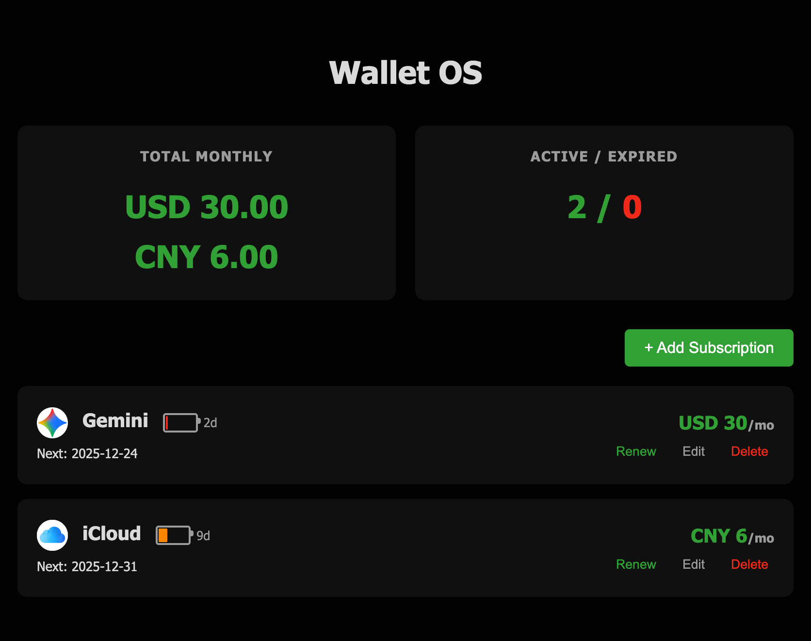

# Wallet OS

Wallet OS 是一个现代化的个人订阅管理工具，帮助您轻松跟踪和管理各类周期性支出（如 Netflix, Spotify, iCloud 等）。

灵感来源于 Wallos 项目，由 Vibe Coding 驱动开发。


<br/>

<div align="center">
    <!-- 请替换下方链接为您的真实项目截图，建议放置在 docs/screenshot.png -->
    <!-- Please replace the link below with your actual project screenshot, e.g., docs/screenshot.png -->
    
    
</div>

<br/>

## ✨ 核心功能 (Features)

- **💰 费用追踪**: 自动计算每月总支出，支持多币种显示。
  - **精确计算**: 对于非月付/年付的订阅（如四年付），支持通过“开始日期”精确计算月均分摊费用。
- **🤖 AI 智能填单**: 
  - 粘贴订阅确认邮件或账单短信，AI 自动提取名称、价格、周期和日期并填充表单。
  - 支持 OpenAI 兼容接口，未配置 Key 时提供本地关键词匹配（Mock）模式。
- **🧠 AI 财务顾问**:
  - 基于您的当前订阅列表，智能生成优化建议（如发现冗余订阅、推荐更具性价比的替代方案等）。
- **🔋 续费倒计时**: 独特的“电池电量”可视化效果，直观展示距离下次扣费的天数（绿色->红色->灰色）。
- **♾️ 永久订阅支持**: 支持记录一次性买断（Lifetime）的软件或服务，不计入每月经常性支出。
- **🔍 智能图标匹配**: 
  - 输入订阅名称（如 "iqiyi"）自动搜索并匹配官方高清图标。
  - 支持“三级回退”策略 (Google -> DuckDuckGo -> UI Avatars)，确保 100% 有图显示。
  - **秒级响应**: 采用 Promise 预加载技术，在您填写表单时后台自动完成搜索。
- **✏️ 灵活编辑**: 支持随时修改订阅信息（名称、价格、周期等），并在编辑时自动重新匹配图标。
- **🛡️ 安全删除**: 删除订阅时需要输入名称确认，防止误操作。
- **⚡ 高性能**: 基于 Rust + Axum 构建，占用资源极低，响应速度极快。
- **🐳 轻松部署**: 提供 Docker 和 Docker Compose 支持，一键启动。

## 🛠️ 技术栈 (Tech Stack)

本项目采用全栈 Rust 构建，追求极致的性能与安全性：

- **后端 (Backend)**: 
  - [Rust](https://www.rust-lang.org/) (语言核心)
  - [Axum](https://github.com/tokio-rs/axum) (高性能异步 Web 框架)
  - [SQLx](https://github.com/launchbadge/sqlx) (类型安全的异步 SQL 工具)
  - [Reqwest](https://github.com/seanmonstar/reqwest) (HTTP 客户端，用于图标搜索 API)
  - [Scraper](https://github.com/causal-agent/scraper) (HTML 解析，用于辅助域名查找)
- **数据库 (Database)**: 
  - [SQLite](https://www.sqlite.org/) (轻量级嵌入式数据库，数据持久化)
- **前端 (Frontend)**: 
  - 原生 HTML5 / CSS3 (Flexbox & Grid 布局)
  - Vanilla JavaScript (ES6+, 无繁重框架依赖)
- **运维 (DevOps)**: 
  - Docker (多阶段构建，极致压缩镜像体积)
  - Docker Compose (一键编排)

## 🚀 快速开始 (Getting Started)

### 方式一：Docker 部署 (推荐)

如果您不想配置本地 Rust 环境，这是最快的方式。

1. **克隆项目**:
   ```bash
   git clone https://github.com/yourusername/wallet-OS.git
   cd wallet-OS
   ```

2. **配置 AI (可选)**:
   如果不配置，将默认使用 Mock 模式。
   ```bash
   # 修改 ai-assistant-api.env 文件填入您的 API Key
   vi ai-assistant-api.env
   ```

3. **启动服务**:
   ```bash
   # 构建并启动容器
   docker-compose up -d --build
   ```

4. **访问应用**:
   打开浏览器访问 `http://localhost:8081`。
   *数据将自动持久化到 `./wallet_os_data` 目录。*

### 方式二：本地开发 (Local Development)

1. **安装依赖**:
   确保已安装 [Rust](https://rustup.rs/) (最新稳定版)。

2. **运行项目**:
   ```bash
   # 首次运行会自动下载依赖并编译
   cargo run
   ```
默认监听端口为 `80`，在 Linux 下可能需要使用 `sudo cargo run`。如果需要自定义端口，可设置环境变量 `PORT`，例如：`PORT=8080 cargo run`。

### 环境变量 (Environment)

- `DATABASE_URL`: SQLite 连接字符串，默认值为 `sqlite:wallet-os.db`。
  - 示例（自定义路径）：`export DATABASE_URL=sqlite:./wallet_os_data/wallet-os.db`
  - 首次启动会自动创建数据库文件与父目录。
- `PORT`: 后端服务监听端口，默认 `80`。

#### AI 功能配置 (Optional)

要启用 AI 智能填单和财务分析功能，请配置以下环境变量：

- `OPENAI_API_KEY`: 您的 OpenAI API 密钥（或兼容服务的密钥）。
- `OPENAI_API_BASE`: API 基础地址 (默认: `https://api.openai.com/v1`)。
- `OPENAI_MODEL`: 使用的模型名称 (默认: `gpt-3.5-turbo`)。

> **注意**: 如果未配置 `OPENAI_API_KEY`，系统将自动降级为 **Mock 模式**，使用本地简单的关键词匹配逻辑演示功能。

#### 提示词配置 (Prompts)

您可以通过修改 `static/prompts.json` 文件来自定义 AI 的行为和角色设定。

- 使用 DeepSeek（OpenAI 兼容方式）：将 `OPENAI_*` 指向 DeepSeek 的网关与模型即可。
  - Docker 部署：`docker-compose.yml` 已通过 `env_file: ai-assistant-api.env` 注入变量，示例：
    ```env
    # ai-assistant-api.env
    OPENAI_API_KEY=your_deepseek_key
    OPENAI_API_BASE=https://api.deepseek.com/v1
    OPENAI_MODEL=deepseek-chat
    ```
  - 本地运行：
    ```bash
    export OPENAI_API_KEY=your_deepseek_key
    export OPENAI_API_BASE=https://api.deepseek.com/v1
    export OPENAI_MODEL=deepseek-chat
    cargo run
    ```
- 关于 README 中提到的“ChatGPT Plus”关键词：仅用于无密钥/失败时的演示模式文本匹配，不限制你实际使用的供应商。
- 可选增强：若希望改用 `DEEPSEEK_*` 变量名（如 `DEEPSEEK_API_KEY/BASE/MODEL`），请在代码中增加对应的读取逻辑或保持使用上述兼容方式。

### 日志 (Logs)

- 运行时会将日志写入 `./logs/wallet-os-YYYY-MM-DD.log`（按日滚动）。
- Docker 部署已将宿主机 `./logs` 挂载到容器 `/app/logs`，方便持久化与查看。

### 构建与发布 (Build & Release)

```bash
# 生成发布版二进制
cargo build --release

# 运行发布版（可指定数据库路径）
export DATABASE_URL=sqlite:./wallet_os_data/wallet-os.db
sudo ./target/release/wallet-os
```

3. **访问应用**:
   打开浏览器访问 `http://localhost`。

## 📂 项目结构 (Project Structure)

```
.
├── src/
│   ├── main.rs      # 程序入口，路由注册，跨域配置
│   ├── handlers.rs  # 核心业务逻辑 (API Controller)，含 DuckDuckGo 搜索逻辑
│   ├── models.rs    # 数据结构定义 (Subscription, SearchResult 等)
│   └── db.rs        # 数据库连接池初始化与迁移
├── static/          # 前端资源
│   ├── index.html   # 单页应用入口 (含 JS 逻辑：预加载、动画、表单验证)
│   └── style.css    # 样式表 (响应式设计、卡片布局、电池动画)
├── Cargo.toml       # Rust 项目依赖配置
├── Dockerfile       # 多阶段 Docker 构建文件 (Builder -> Runtime)
├── docker-compose.yml # 容器编排配置
└── README.md        # 项目文档
```

## 🔔 实时更新 (Realtime)

- 前端通过 `EventSource` 监听 `GET /api/stream` 的 Server-Sent Events。
- 当后端检测到订阅数据变更时，会推送一个 `"update"` 事件。
- 前端接收事件后调用列表接口刷新展示，避免轮询带来的额外开销。


## 🧠 核心代码 (Core Code)

> 以下代码片段展示项目的关键实现，便于快速理解整体架构与数据流。

- 路由与中间件 (`src/main.rs`)
  ```rust
  let app = Router::new()
      .route(
          "/api/subscriptions",
          get(handlers::list_subscriptions).post(handlers::create_subscription),
      )
      .route(
          "/api/subscriptions/:id",
          delete(handlers::delete_subscription).put(handlers::update_subscription),
      )
      .route(
          "/api/search",
          get(|state, query| async move { handlers::search_domain(state, query).await }),
      )
      .route("/api/icon", get(handlers::get_icon))
      .nest_service("/", ServeDir::new("static"))
      .layer(CorsLayer::permissive())
      .layer(CompressionLayer::new())
      .layer(TraceLayer::new_for_http())
      .with_state(pool);
  ```

- 域名搜索逻辑 (`src/handlers.rs`)
  ```rust
  #[axum::debug_handler]
  pub async fn search_domain(
      State(_pool): State<DbPool>,
      Query(params): Query<SearchQuery>,
  ) -> axum::response::Response {
      let query = params.q.trim();
      if query.is_empty() {
          return (StatusCode::BAD_REQUEST, "Query is empty".to_string()).into_response();
      }

      if let Some(cached) = { SEARCH_CACHE.read().get(query).cloned() } {
          return Json(SearchResult { domain: cached }).into_response();
      }

      // 1) 优先使用 DuckDuckGo API
      let api_url = format!(
          "https://api.duckduckgo.com/?q={}&format=json",
          urlencoding::encode(query)
      );
      let client = reqwest::Client::builder()
          .user_agent("Mozilla/5.0 (Windows NT 10.0; Win64; x64)")
          .timeout(Duration::from_secs(8))
          .build()
          .map_err(|e| (StatusCode::BAD_GATEWAY, e.to_string()).into_response())
          .unwrap();

      if let Ok(resp) = client.get(&api_url).send().await {
          if let Ok(text) = resp.text().await {
              if let Ok(ddg_resp) = serde_json::from_str::<DdgResponse>(&text) {
                  // OfficialWebsite / AbstractURL / Results
                  // 命中后写入缓存并返回
              }
          }
      }

      // 2) 回退到 DuckDuckGo HTML，解析真实链接
      let url = format!(
          "https://html.duckduckgo.com/html/?q={}",
          urlencoding::encode(query)
      );
      let resp = client.get(&url).send().await.map_err(|e| {
          (StatusCode::BAD_GATEWAY, e.to_string()).into_response()
      })?;
      let body = resp.text().await.map_err(|e| {
          (StatusCode::BAD_GATEWAY, e.to_string()).into_response()
      })?;

      let document = scraper::Html::parse_document(&body);
      let selector = scraper::Selector::parse(".result__a, .result__url, .links_main a").unwrap();
      for element in document.select(&selector) {
          if let Some(href) = element.value().attr("href") {
              // 解析重定向并提取域名，命中后写入缓存并返回
          }
      }

      (StatusCode::NOT_FOUND, "No domain found".to_string()).into_response()
  }
  ```

- 获取网站图标 (`src/handlers.rs`)
  ```rust
  #[axum::debug_handler]
  pub async fn get_icon(Query(params): Query<IconQuery>) -> Response {
      let mut domain = params.domain.to_lowercase();
      domain.retain(|c| c.is_ascii_alphanumeric() || c == '.' || c == '-');
      if domain.is_empty() {
          return (StatusCode::BAD_REQUEST, "invalid domain").into_response();
      }
      let sz = params.sz.unwrap_or(64);
      let file_name = format!("{}_{}.png", domain, sz);
      let dir = "static/icons";
      let path = format!("{}/{}", dir, file_name);
  
      if let Ok(mut f) = fs::File::open(&path).await {
          let mut buf = Vec::new();
          if f.read_to_end(&mut buf).await.is_ok() {
              let mut resp = Response::new(buf.into());
              resp.headers_mut().insert(CONTENT_TYPE, HeaderValue::from_static("image/png"));
              resp.headers_mut().insert(CACHE_CONTROL, HeaderValue::from_static("public, max-age=604800"));
              return resp;
          }
      }
  
      let _ = fs::create_dir_all(dir).await;
      let url = format!("https://www.google.com/s2/favicons?domain={}&sz={}", domain, sz);
      let client = reqwest::Client::builder().user_agent("Mozilla/5.0").timeout(Duration::from_secs(8)).build().unwrap();
      let bytes = client.get(&url).send().await.unwrap().bytes().await.unwrap();
      let _ = fs::write(&path, &bytes).await;
      let mut resp = Response::new(bytes.into());
      resp.headers_mut().insert(CONTENT_TYPE, HeaderValue::from_static("image/png"));
      resp.headers_mut().insert(CACHE_CONTROL, HeaderValue::from_static("public, max-age=604800"));
      resp
  }
  ```

- 订阅 CRUD 示例 (`src/handlers.rs`)
  ```rust
  pub async fn list_subscriptions(State(pool): State<DbPool>) -> Result<Json<Vec<Subscription>>, String> {
      let subs = sqlx::query_as::<_, Subscription>("SELECT * FROM subscriptions ORDER BY next_payment ASC")
          .fetch_all(&pool)
          .await
          .map_err(|e| e.to_string())?;
      Ok(Json(subs))
  }
  
  pub async fn create_subscription(State(pool): State<DbPool>, Json(payload): Json<CreateSubscription>) -> Result<Json<Subscription>, String> {
      if payload.name.trim().is_empty() { return Err("Name is required".to_string()); }
      if ![0,1,3,12].contains(&payload.frequency) { return Err("Invalid frequency".to_string()); }
      let (price, next_payment) = if payload.frequency == 0 {
          (payload.price.unwrap_or(0.0), None)
      } else {
          if payload.price.is_none() { return Err("Price is required for non-lifetime subscriptions".to_string()); }
          if payload.next_payment.is_none() { return Err("Next payment date is required for non-lifetime subscriptions".to_string()); }
          (payload.price.unwrap(), payload.next_payment)
      };
      let id = sqlx::query(r#"INSERT INTO subscriptions (name, price, currency, next_payment, frequency, url, logo, start_date) VALUES (?, ?, ?, ?, ?, ?, ?, ?)"#)
          .bind(&payload.name).bind(price).bind(&payload.currency).bind(&next_payment).bind(payload.frequency).bind(&payload.url).bind(&payload.logo).bind(&payload.start_date)
          .execute(&pool).await.map_err(|e| e.to_string())?.last_insert_rowid();
      Ok(Json(Subscription { id, name: payload.name, price, currency: payload.currency, next_payment, frequency: payload.frequency, url: payload.url, logo: payload.logo, start_date: payload.start_date, active: true }))
  }

  pub async fn update_subscription(State(pool): State<DbPool>, Path(id): Path<i64>, Json(payload): Json<CreateSubscription>) -> Result<Json<Subscription>, String> {
      if payload.name.trim().is_empty() { return Err("Name is required".to_string()); }
      if ![0,1,3,12].contains(&payload.frequency) { return Err("Invalid frequency".to_string()); }
      let (price, next_payment) = if payload.frequency == 0 {
          (payload.price.unwrap_or(0.0), None)
      } else {
          if payload.price.is_none() { return Err("Price is required for non-lifetime subscriptions".to_string()); }
          if payload.next_payment.is_none() { return Err("Next payment date is required for non-lifetime subscriptions".to_string()); }
          (payload.price.unwrap(), payload.next_payment)
      };
      let result = sqlx::query(r#"UPDATE subscriptions SET name = ?, price = ?, currency = ?, next_payment = ?, frequency = ?, url = ?, logo = ?, start_date = ? WHERE id = ?"#)
          .bind(&payload.name).bind(price).bind(&payload.currency).bind(&next_payment).bind(payload.frequency).bind(&payload.url).bind(&payload.logo).bind(&payload.start_date).bind(id)
          .execute(&pool).await.map_err(|e| e.to_string())?;
      if result.rows_affected() == 0 { return Err("Subscription not found".to_string()); }
      Ok(Json(Subscription { id, name: payload.name, price, currency: payload.currency, next_payment, frequency: payload.frequency, url: payload.url, logo: payload.logo, start_date: payload.start_date, active: true }))
  }
  
  pub async fn delete_subscription(State(pool): State<DbPool>, Path(id): Path<i64>) -> Result<Json<serde_json::Value>, String> {
      sqlx::query("DELETE FROM subscriptions WHERE id = ?").bind(id).execute(&pool).await.map_err(|e| e.to_string())?;
      Ok(Json(serde_json::json!({ "status": "deleted" })))
  }
  ```
- 数据库初始化与迁移 (`src/db.rs`)
  ```rust
  pub async fn init_db() -> Result<DbPool, sqlx::Error> {
      let database_url =
          env::var("DATABASE_URL").unwrap_or_else(|_| "sqlite:wallet-os.db".to_string());

      let connect_options = SqliteConnectOptions::from_str(&database_url)?
          .journal_mode(SqliteJournalMode::Wal)
          .create_if_missing(true)
          .log_statements(log::LevelFilter::Info);

      let pool = SqlitePoolOptions::new()
          .max_connections(10)
          .connect_with(connect_options)
          .await?;

      sqlx::query(
          r#"
          CREATE TABLE IF NOT EXISTS subscriptions (
              id INTEGER PRIMARY KEY AUTOINCREMENT,
              name TEXT NOT NULL,
              price REAL NOT NULL,
              currency TEXT DEFAULT 'CNY',
              next_payment DATE,
              frequency INTEGER DEFAULT 1,
              url TEXT,
              logo TEXT,
              start_date DATE,
              active BOOLEAN DEFAULT 1
          );
          CREATE INDEX IF NOT EXISTS idx_subscriptions_next_payment ON subscriptions(next_payment);
          CREATE INDEX IF NOT EXISTS idx_subscriptions_name ON subscriptions(name);
          "#
      )
      .execute(&pool)
      .await?;

      Ok(pool)
  }
  ```

- 订阅数据模型 (`src/models.rs`)
  ```rust
  #[derive(Debug, FromRow, Serialize, Deserialize)]
  pub struct Subscription {
      pub id: i64,
      pub name: String,
      pub price: f64,
      pub currency: String,
      pub next_payment: Option<String>,
      pub frequency: i64,
      pub url: Option<String>,
      pub logo: Option<String>,
      pub start_date: Option<String>,
      pub active: bool,
  }
  ```

## 📦 文件与持久化 (Files & Persistence)

| 本地路径 | 容器路径 | 内容说明 | 创建时机 |
|---------|----------|----------|----------|
| `./wallet_os_data/wallet-os.db` | `/app/data/wallet-os.db` | SQLite 数据库文件 | 首次启动自动创建 (代码与 Docker 映射双重兜底) |
| `./wallet_os_data/wallet-os.db-wal` | `/app/data/wallet-os.db-wal` | SQLite WAL 日志文件 (并发优化) | 启用 WAL 模式后读写产生 (`src/db.rs` 配置) |
| `./wallet_os_data/wallet-os.db-shm` | `/app/data/wallet-os.db-shm` | SQLite 共享内存索引文件 | 与 WAL 配套出现 |
| `./logs/wallet-os.log.YYYY-MM-DD` | `/app/logs/wallet-os.log.YYYY-MM-DD` | 运行日志 (按日滚动) | 服务启动即写入 (`src/main.rs` 配置) |
| `./static` | `/app/static` | 前端静态资源 (HTML/CSS/JS) | 仓库已有，容器直接挂载 |
| `./static/icons/<domain>_<size>.png` | `/app/static/icons/<domain>_<size>.png` | 网站图标缓存 (PNG) | 访问 UI 或调用 `/api/icon` 时生成并持久化 |

- 卷与挂载
  - `docker-compose.yml` 使用宿主机绑定挂载：`./wallet_os_data:/app/data`、`./logs:/app/logs`、`./static:/app/static`
  - 文件将落在项目根目录下的对应子目录，便于备份与查看
- 说明
  - WAL/SHM 文件仅在数据库读写时产生，属于 SQLite 正常行为
  - Docker 镜像、容器与网络由 Docker 管理，存储在 Docker 的系统目录中，不位于项目目录
  - Compose 定义了命名卷 `wallet_os_data`，当前服务使用宿主机目录绑定，命名卷处于未使用状态

## 🤝 贡献 (Contributing)

欢迎提交 Issue 或 Pull Request！

1. Fork 本项目
2. 创建您的特性分支 (`git checkout -b feature/AmazingFeature`)
3. 提交您的更改 (`git commit -m 'Add some AmazingFeature'`)
4. 推送到分支 (`git push origin feature/AmazingFeature`)
5. 开启一个 Pull Request

## 📝 许可证 (License)

本项目基于 [MIT License](https://opensource.org/licenses/MIT) 开源。
